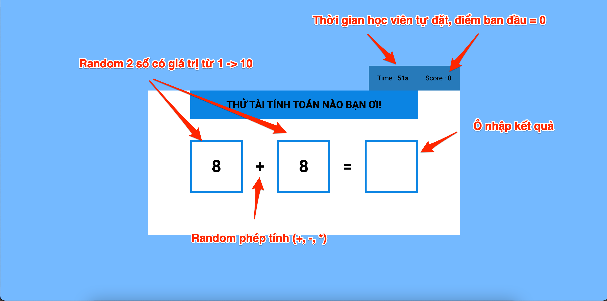
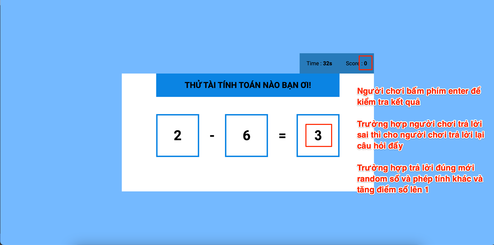
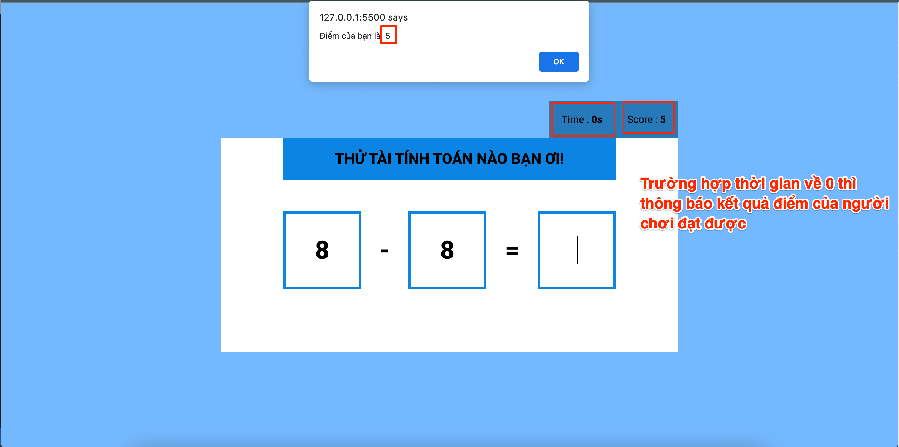

## Random Calculator

Ban đầu khi load trang web, random sẵn 2 số nguyên có giá trị trong khoảng **1 → 10**, và 1 phép tính trong 3 phép tính (+, -, *) để thực hiện tính toán

Thời gian chơi do học viên tự đặt, có thể 30s, 45s, 60s. Khi vào trang thì thời gian tự động đếm ngược (sử dụng **setInterval**)

Khi chơi game người chơi thực hiện điền kết quả vào ô input, và thực hiện bấm **enter** để kiểm tra kết quả

**Nếu kết quả đúng**, lúc này random 2 số và phép tính khác đồng thời điểm của người chơi tăng lên 1

**Nếu ô input để trống**, thì thông báo cho người chơi (Ví dụ: "**Kết quả không được để trống**")

**Nếu kết quả sai** thì cho phép người chơi trả lời lại câu hỏi đó

Khi **thời gian đếm ngược = 0**, lúc này thông báo điểm của người chơi đã đạt được

