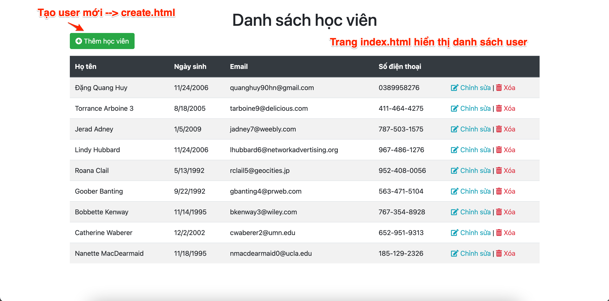
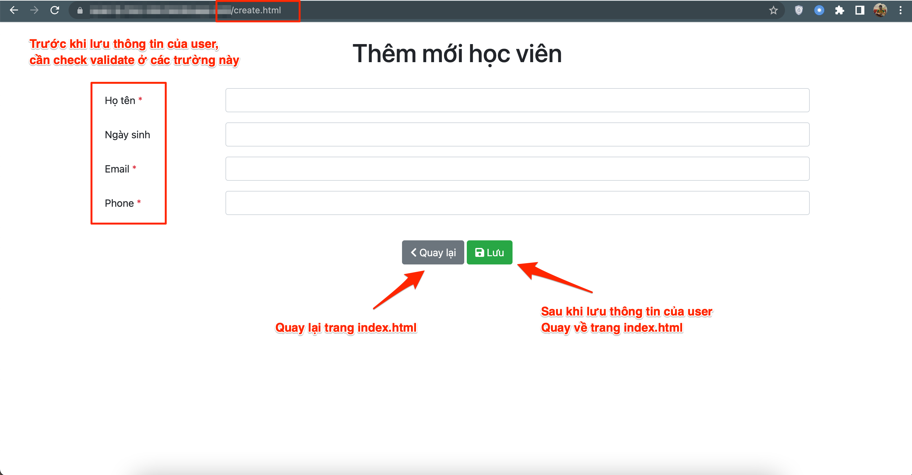
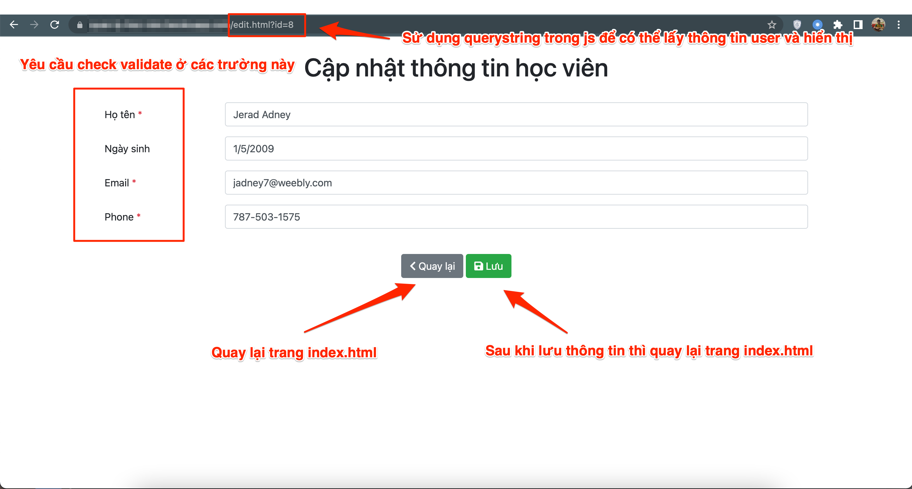
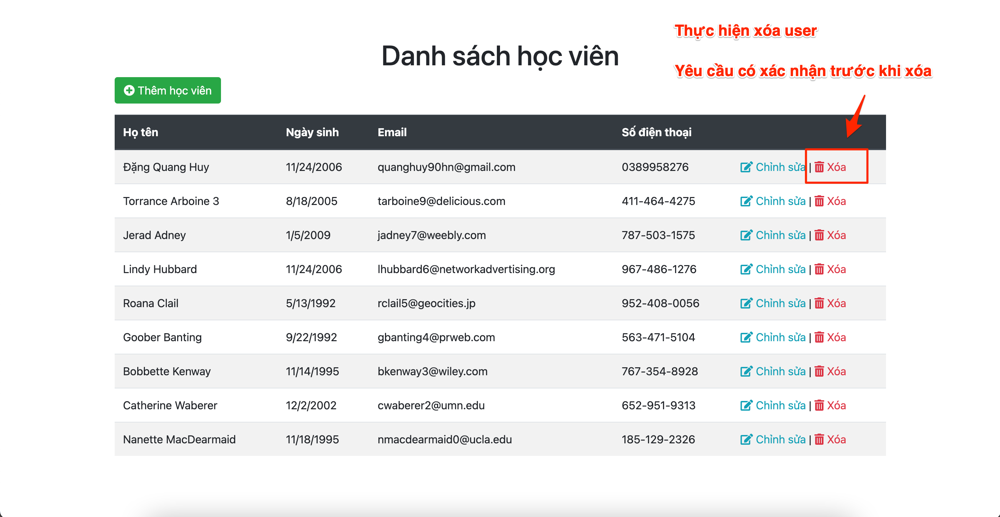

## Ứng dụng quản lý học viên

### Chạy project

1. Cài đặt node_modules

```
npm install
```

2. Chạy server

```
npm start
```

Các chức năng trong ứng dụng học viên cần thực hiện bao gồm:

### 1. Hiển thị danh sách user

-   Trang `index.html`
-   Danh sách user được hiển thị dưới dạng table
-   Danh sách user được hiển thị theo thứ tự `id giảm dần`



### 2. Tạo user

-   Trang `create.html`
-   Yêu cầu check validate ở tất cả các trường
-   Sau khi thêm thành công thì redirect về trang `index.html` để hiển thị



### 3. Cập nhật thông tin user

-   Trang `edit.html`
-   Yêu cầu check validate ở tất cả các trường
-   Sau khi thêm thành công thì redirect về trang `index.html` để hiện thị

> Khi thực hiện chức năng cập nhật thông tin của user. Hãy sử dụng querystring trong javascript để thực hiện

> Ví dụ : http://localhost:3000/ -> http://localhost:3000/edit.html?id=1

> Gợi ý : Sử dụng URLSearchParams



### 4. Xóa user

-   Trang `index.html`
-   Cần xác nhận trước khi xóa 
    - Nếu có --> xóa
    - Nếu không --> bỏ qua




### Ví dụ mẫu về database được sử dụng

Yêu cầu : Cài đặt **Nodejs** trên máy

File `database.json`

```json
{
    "users": [
        {
            "id": 1,
            "name": "Nanette MacDearmaid",
            "email": "nmacdearmaid0@ucla.edu",
            "phone": "185-129-2326",
            "birthday": "11/18/1995"
        },
        {
            "id": 2,
            "name": "Catherine Waberer",
            "email": "cwaberer2@umn.edu",
            "phone": "652-951-9313",
            "birthday": "12/2/2002"
        },
        {
            "id": 3,
            "name": "Bobbette Kenway",
            "email": "bkenway3@wiley.com",
            "phone": "767-354-8928",
            "birthday": "11/14/1995"
        }
    ]
}
```

### Tài liệu tham khảo

Học viên tham khảo các bài viết sau để làm bài

-   [Ứng dụng todolist + Kết nối API : Khởi tạo server (Phần 1)](https://techmaster.vn/posts/36848/ung-dung-todolist-ket-noi-api-khoi-tao-server-phan-1)
-   [Ứng dụng todolist + Kết nối API : Lập trình chức năng (Phần 2)](https://techmaster.vn/posts/36849/ung-dung-todolist-ket-noi-api-lap-trinh-chuc-nang-phan-2)
-   [Ứng dụng todolist + Kết nối API : Deploy ứng dụng lên Heroku (Phần 3)](https://techmaster.vn/posts/36850/ung-dung-todolist-ket-noi-api-deploy-ung-dung-len-heroku-phan-3)
